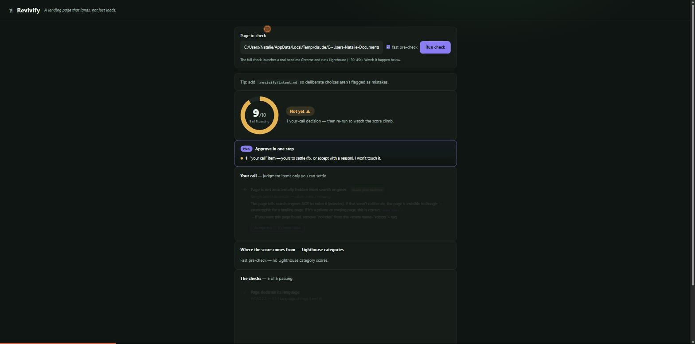

# Revivify

> **A landing page that lands — not just loads.**

Revivify is a quality gate for **people who build software with AI but don't write code themselves.** It steers your coding agent toward established best practices up front, then checks the result against **citable standards** — WCAG 2.2, Core Web Vitals, Google Search Essentials — and hands you a plain-language, ship-or-don't verdict.



*The cockpit (`revivify ui`) on a real landing page: it lands at **9/10** because a leftover `noindex` is a judgment call only you can make — accept it with a reason, and the trust dial clears to **10/10 · Ship-ready**. Every check cites the exact standard behind it.*

## See it on a real page

[`demo-site/`](demo-site/) is a styled "Bloom" landing page that **looks shippable but fails silently** — the exact defects an AI agent hands a non-developer without guardrails: no `<html lang>`, a hero image with no `alt`, no meta description, and a leftover `noindex`. Nothing looks broken in a browser; the failures are all invisible.

```bash
npm install
npm run dev -- ui ./demo-site     # ⭐ the cockpit — watch the audit happen (the GIF above)
npm run check -- ./demo-site      # the same audit, in your terminal
```

```
$ revivify check ./demo-site

  Trust: 7/10 — 7 of 10 checks passing
  Lighthouse: Performance 100 · Accessibility 88 · Best Practices 100 · SEO 45

  ✗ Images have alt text            WCAG 2.2 — 1.1.1 Non-text Content (Level A)   [We'll fix it]
  ✗ Page declares its language      WCAG 2.2 — 3.1.1 Language of Page (Level A)   [We'll fix it]
  ✗ Page has a meta description     Google Search Essentials — meta description  [We'll fix it]
  ✓ Text has enough contrast        …and 4 more passing

  Your call — judgment items only you can settle:
  ◇ Page isn't accidentally hidden from search engines   [needs your decision]

  Not yet ⚠️  — 3 checks to fix, and 1 your-call decision to make.
```

Fix the three safe ones (your agent applies them), **accept** the `noindex` with a reason — and it's **10/10 · Ship-ready ✅** (exit `0`). Full before/after in [`demo-site/README.md`](demo-site/README.md).

## Why it exists

I'm not a developer. I build things with AI agents. Every time, I hit the same wall: *I can ship code, but I can't tell if it's slop.* Revivify is the tool I wanted — one that lets a non-developer trust AI-written code, because its judgments come from real, published standards, not an opinion.

## How it works

1. **`revivify init`** — drops a best-practice **rules pack** that steers your coding agent, a one-page **plan + definition-of-done**, a **`.revivify.yaml`** config, and a **Claude Code hook** that runs the check automatically and blocks "done" until the page clears the bar.
2. **Build** your landing page with your AI agent as usual — now guided.
3. **`revivify check`** — validates the output against cited standards and returns a **trust score** (e.g. *7 / 10 — 7 of 10 checks passing*), each finding **citing the exact standard** it comes from, with fixes triaged as **"we'll fix it" / "just so you know" / "your call."**
4. The agent applies the safe fixes, you settle the judgment calls, Revivify re-checks — until it's **ship-ready** (a perfect 10/10).

## What makes it different

- **Proactive, not after-the-fact.** Most tools scan a site *after* it's built. Revivify steers the agent *while* it builds — the one space the market leaves open.
- **Built for non-developers.** Every other AI-code checker assumes an engineer reads the output. Revivify assumes you can't: plain language to you, structured data to the agent.
- **Authority from standards, not vibes.** Verdicts cite **WCAG 2.2 AA**, **Core Web Vitals**, and **Google Search Essentials** — checked with the same deterministic engines the pros use (axe-core, Lighthouse). No "our AI thinks…".
- **Nothing broken left behind.** The bar is a perfect **10/10**; a judgment call ("your call") never counts as a silent pass — you resolve it, or knowingly accept it with a recorded reason.

## Status

🔨 **Building.** Shipped so far: **M0–M4 (v0.1.0 → v0.5.0).** The engine (axe-core + Lighthouse, 13 cited rules), the visual **cockpit** (`revivify ui`), `revivify init` + the **Claude Code "done" hook**, and the full **Check UX** (intent capture, three-way triage, the own-the-fix loop, per-finding cite→teach→verify) are all live. Currently on **M5 — demo + polish** (this demo, the cockpit GIF, and `.revivify.yaml` rule toggles). Two of the 15 catalog rules (non-text contrast, broken links) don't have a trustworthy automatic check yet and are **deferred, not faked** — see [decision log #10](docs/decision-log.md). Milestones live in the [PRD](docs/prd.md).

The check exits `0` only at a perfect **10/10** (ship-ready) and non-zero otherwise — the deterministic gate the Claude Code hook hangs off. Add `--fast` for an instant static pre-check (no browser) while iterating.

### Product docs

- [`docs/prd.md`](docs/prd.md) — the product requirements (problem, users, metrics, scope, milestones)
- [`docs/spec.md`](docs/spec.md) — the product spec
- [`docs/rule-catalog.md`](docs/rule-catalog.md) — the prioritized, cited rule set (15 MVP checks + roadmap)
- [`docs/competitive-landscape.md`](docs/competitive-landscape.md) — how Revivify sits against existing tools
- [`docs/decision-log.md`](docs/decision-log.md) — the key product & architecture decisions and their rationale
- [`docs/walkthroughs/`](docs/walkthroughs/) — a plain-language, cockpit-first guide per milestone, each ending in an acceptance checklist
- [`docs/github-workflow.md`](docs/github-workflow.md) — how we work: the SDLC / GitHub loop every change runs through (issue → branch → PR → gate → release)

## Run it locally

Requires Node ≥ 20.

```bash
npm install
npm run dev -- ui ./demo-site          # ⭐ the visual cockpit — watch the audit happen
npm run walkthrough                    # a narrated 2-minute tour
npm run check -- ./demo-site           # full Lighthouse audit (~30–45s)
npm run check -- ./demo-site --fast    # instant static pre-check (no browser)
npm test                               # run the test suite
npm run build                          # compile to dist/ (provides the `revivify` bin)
```

The full audit launches headless Chrome (auto-detected). `stdout` carries structured results for a coding agent; `stderr` carries the plain-language report and trust score for you.

### Try it / verify it as the end user

You don't need to read code to confirm Revivify works:

- **`npm run dev -- ui ./demo-site`** — the cockpit, on the demo page (the GIF above).
- **[`examples/`](examples/)** — pages with known results to check and compare against.
- **[`docs/walkthroughs/`](docs/walkthroughs/)** — a plain-language guide per milestone, each ending in an **acceptance checklist** you sign off to say "yes, this is the right thing."

## Architecture

An **[AXI](https://axi.md/)-designed CLI** (`revivify`) in **Node / TypeScript**, wrapping **Lighthouse** (which runs **axe-core** for accessibility), plus a **local web-app cockpit** (`revivify ui`) that reuses the same engine, and a **Claude Code Stop hook** that gates "done." No MCP server — see the [decision log](docs/decision-log.md) for why.

Inside `src/`: `cli.ts` (entry) → `commands/` (`check.ts` orchestration full vs `--fast`; `ui.ts` serves the cockpit + streams the audit over SSE; `init.ts` scaffolds the guardrails; `gate.ts` is the hook's decision) → `engine/lighthouse.ts` (serves the page over loopback HTTP, drives headless Chrome, reports progress + category scores + audits) → `checks/` (rule packs: `lighthouse.ts` maps audits to cited findings, `staticHtml.ts` is the fast pre-check, `toggles.ts` applies `.revivify.yaml` rule toggles) → `score.ts` (trust-score rollup + the your-call track) → `report/` (a plain-language channel for the human and a structured channel for the agent). The cockpit's front-end lives in `web/`.
